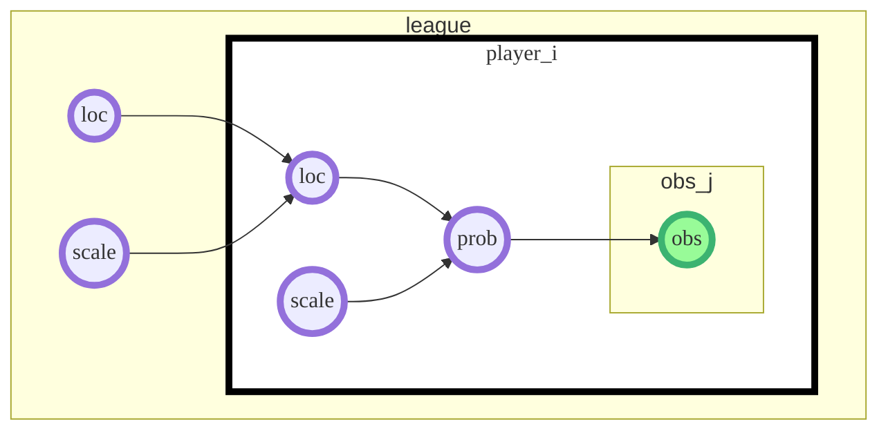

Both Markov chain Monte Carlo (MCMC) and Approximate Bayesian Computation (ABC) want to estimate the posterior: $p(\theta \mid x) \propto p(x \mid \theta)p(\theta)$​.

$$
\begin{aligned}
p(\theta \mid x) &= \frac {p(x \mid \theta)p(\theta)}{p(x)} \\
&= \frac{\int p(x, z\mid \theta)p(\theta)dz}{p(x)} \\
&= \frac{\int p(x \mid z, \theta)p(z \mid \theta)p(\theta)dz}{p(x)}
\end{aligned}
$$
I like the idea of "tracing all possible paths" to get to the observation.

So we need to find an example where the full parameter state isn't visible at the end of the simulation OR demonstrate that there are so many states that MCMC becomes ridiculous. But if we can't write the likelihood of even a single latent state, our likelihood goes up in smoke, like our hopes of using MCMC.

I think my book example might not have been valid MCMC... I should've include the likelihoods of each latent parameter. And there were a lot. The result would've been joint samples across ALL the possible parameters. The process should have been something like:

```python
sample mean delay and reading speed from the global prior
while not completed a year:
	sample length of book_i
	while not book finished:
		sample pages read on day_j
	sample delay after book_i
take ALL the sampled values and calculate their likelihoods
use this combined likelihood for MCMC
```

This probably would've been more computationally expensive since the acceptance would've dropped. We went from "let's randomly walk 2 parameters to high joint probability states" to "let's walk 400 parameters to high joint probability states." That's way harder. Plus it more or less assumes that the problem structure is constant . . . what if the underlying structure is unstable?

So what's a good example to demonstrate this?

- Baseball hierarchical model
  - We could have a single global state



For 200 players this would give 402 parameters . . .

https://arxiv.org/pdf/1911.01429.pdf

https://royalsocietypublishing.org/doi/pdf/10.1098/rsos.191315
